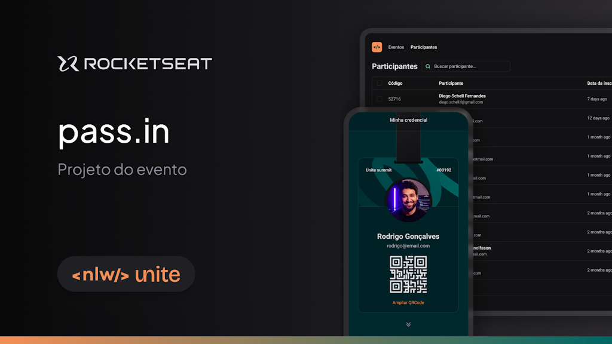

# 📅 pass.in

Neste projeto, aprofundei meus conhecimentos em React, TypeScript e uso de URL State, aplicando recursos de páginação, requisições de API com fetch e estilização com Tailwindcss. Essas experiências fortaleceram minhas habilidades práticas nessas tecnologias, contribuindo para a criação eficiente de aplicações robustas.

Confira a execução do 📅 [pass.in][deploy].

## 🚀 Começando

* Consulte **[Instalação](#-instalação)** para clonar e configurar o projeto;
* Consulte **[Como Iniciar o Projeto](#-como-iniciar-o-projeto)** para saber como iniciar o projeto;
* Consulte **[Tecnologias Utilizadas](#%EF%B8%8F-tecnologias-utilizadas)** para conhecer as tecnologias utilizadas.

### 📋 Pré-requisitos
Necessita de `Node.js v20+` para rodar. Verifique a versão do Nodejs instalada na sua máquina.

```bash
node --version
```

Você receberá a seguinte mensagem após executar o comando, indicando a sua versão do Node.js.
```bash
v20.7.0
```

### 🔧 Instalação

Caso não seja identificado o ``Nodejs``, instale a **versão LTS** [clicando aqui](https://nodejs.org/en)

Clone este repositório para o seu ambiente local:
```bash
git clone https://github.com/Wellington-Henrique/pass-in-web-react-js
```

Instale as dependências do projeto:
```bash
npm i
```

## 📦 Como Iniciar o Projeto

Abra a pasta do projeto no seu editor favorito.

.**..ou utilize o seguinte comando na raiz do projeto se tiver o Visual Code instalado**:
```bash
code .
```

Utilize a API presente no projeto, ou inicie o servidor de teste com o seguinte comando:
```bash
npm run server
```

Inicie a aplicação:
```bash
npm run dev
```

A aplicação iniciará em modo de desenvolvimento. [Clique aqui](http://localhost:5173/) para visualizar a aplicação no seu navegador. Normalmente o **vite** utiliza a porta **5173**.

## 🛠️ Tecnologias Utilizadas

* ⚡ [Vite](https://vitejs.dev/): Um construtor de aplicações JavaScript rápido e flexível;
* 🎨 [Tailwindcss](https://tailwindcss.com/): Biblioteca de estilização;
* 🔍 [TypeScript](https://www.typescriptlang.org/): Linguagem superset JavaScript que adiciona tipagem estática opcional;
* 📅 [Dayjs](https://day.js.org/): Biblioteca JavaScript de manipulação de datas;
* 📚 [Lucide React](https://lucide.dev/guide/packages/lucide-react): Biblioteca de ícones para Reactjs;
* 📑 [Faker](https://fakerjs.dev/): Biblioteca JavaScript que permite criar um seed de dados para testar o frontend, sem a necessidade de uma API, contruibuindo com o desenvolvimento do inicial do projeto.

## 🌟 Principais Funcionalidades

* 📋 Listar participantes do evento;
* 🔄 Páginação.

## ✒️ Autores
* **Rocketseat** - *NLW Unite React* - [Rocketseat Education][rocketseat-git-url]

## 🖇️ Contribuição

* **Wellington Henrique** - *Implementação em aula* - [LinkedIn][linkedin-url]

## Banner do Projeto



Se você encontrar problemas, bugs ou tiver sugestões para melhorar este projeto, sinta-se à vontade para abrir uma issue ou enviar um pull request.

## 📜 Licença
MIT

## 🎁 Expressões de gratidão

* Agradeço a [Rocketseat][rocketseat-linkedin-url] por compartilhar este conhecimento!🫂.

---

☕ [pass.in][deploy] com ❤️ por [Wellington Henrique][linkedin-url] 😊

[linkedin-url]: https://www.linkedin.com/in/wellingtonhlc/
[deploy]: https://pass-in-web-react-js.vercel.app/
[rocketseat-linkedin-url]: https://www.linkedin.com/school/rocketseat/
[rocketseat-git-url]: https://github.com/rocketseat-education/nlw-unite-react